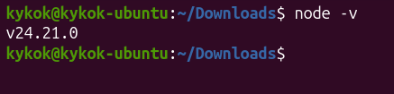
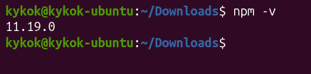

# Praktikum Menyiapkan dan Memulai Pemrograman Mobile (react native) #

### Tujuan Pembelajaran ###
Mahasiswa mampu :
1. Menyiapkan dan Memulai pemrograman mobile (react native)
2. Membuat Aplikasi Mobile (React Native)
3. Membuat CV sederhana dengan React Native

### Materi Pembelajaran ###
1. Menyiapkan dan memulai Pemrograman Mobile (React Native)
- Install Interpreter Node.JS
- Download dan install node.js di alamat https://nodejs.org/en/download
- konfirmmasi versi node.js
- node -v

 

- konfirmasi versi npm
- npm -v

 

2. Membuat Aplikasi Mobile (React Native)
- Untuk Referensi Dokumentasi Resmi milik Expo
- https://docs.expo.dev/
- untuk Referensi Dokumentasi Resmi milik React Native
- https://reacnative.dev/
- Memulai membuat projek baru dengan Framework Espo Go
- npx create-expo-app ptmn2 --template blank

3. Menjalankan Aplikasi Mobile (React Native)
- cd ptmn2
- npx expo start
- install expo go via playstore
- 