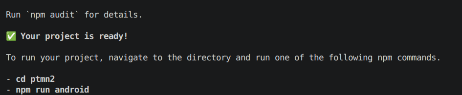
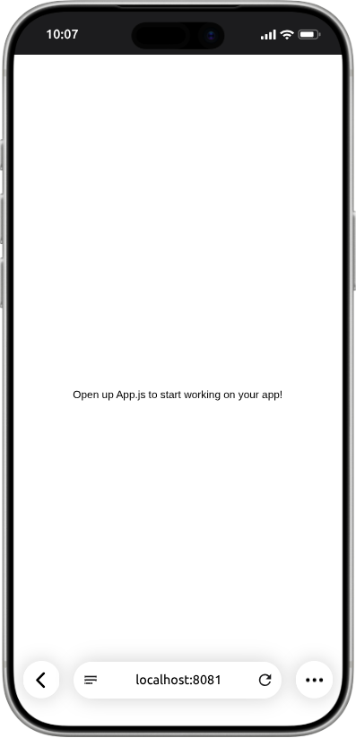
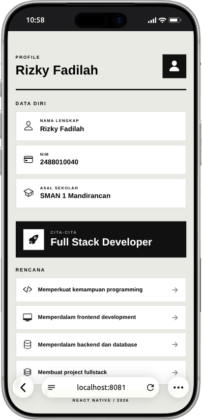

# Praktikum Menyiapkan dan Memulai Pemrograman Mobile (react native) #

### Tujuan Pembelajaran ###
Mahasiswa mampu :
1. Menyiapkan dan Memulai pemrograman mobile (react native)
2. Membuat Aplikasi Mobile (React Native)
3. Membuat CV sederhana dengan React Native

### Materi Pembelajaran ###
1. Menyiapkan dan memulai Pemrograman Mobile (React Native)
- Install Interpreter Node.JS
- Download dan install node.js di alamat https://nodejs.org/en/download
- konfirmmasi versi node.js
- node -v
 

 

- konfirmasi versi npm
- npm -v
 

 

2. Membuat Aplikasi Mobile (React Native)
- Untuk Referensi Dokumentasi Resmi milik Expo
- https://docs.expo.dev/
- untuk Referensi Dokumentasi Resmi milik React Native
- https://reacnative.dev/
- Memulai membuat projek baru dengan Framework Espo Go
- perubahan direktori ke folder ke praktik (Pemrograman Mobile->Pertemuan-2)
- npx create-expo-app ptmn2 --template blank
 

 

3. Menjalankan Aplikasi Mobile (React Native)
- cd ptmn2
- npx expo start
- install expo go via playstore
- menginstal Expo pergi melalui app store
- Buka dan Scan QR Code Via Expo Go
- Running via Web Browser Emulator
- ctrl+c untuk menghetikan server
- sebelumnya install (npx expo install react-dom react-native-web)
- npx expo start --web 
 

4. Tugas Praktikum Pemrograman Seluler (React Native)
- Menambagkan CV sederhana dengan React Native
- Nama Lengkap
- NIM
- Asal Sekolah
- Cita-cita
- Rencana Mencapai Cita-cita

